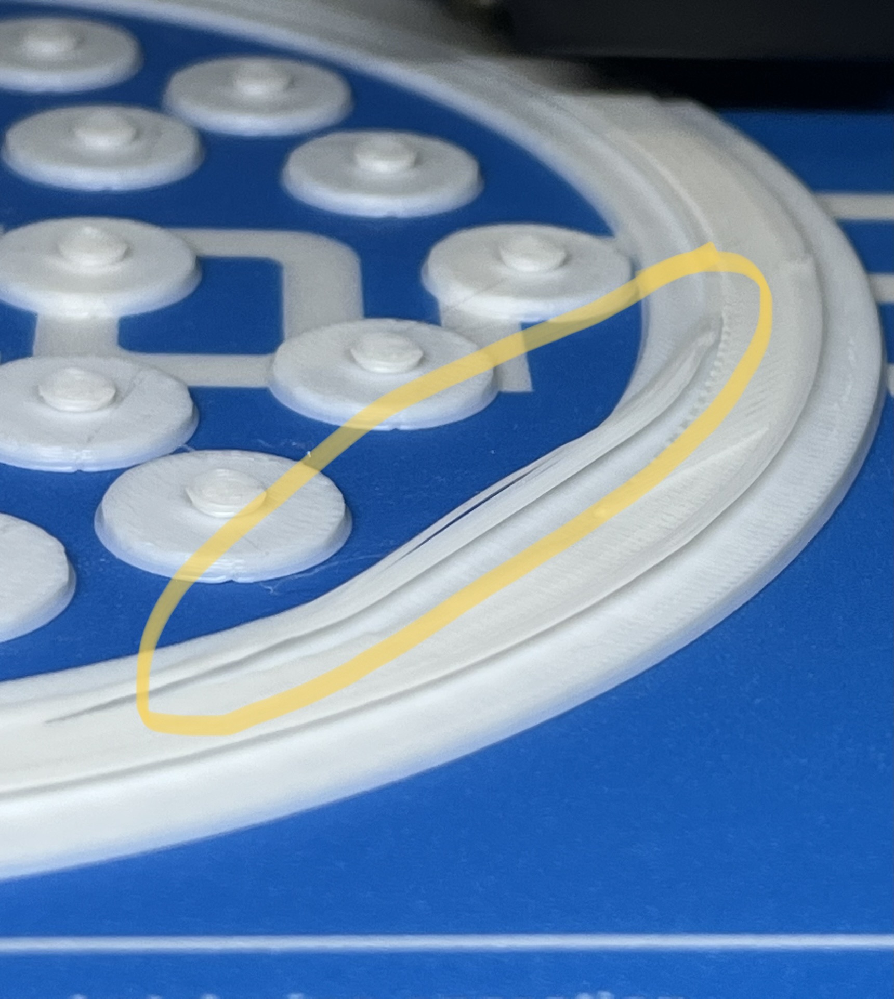

# Floating platform

There are several platforms you can use on the Airtrack. The shape of the platfrom varies depending on your research question. 

It's important to be aware about the influence of the material's surface to the mouse. The layer height and the material of the print are the main factors of the surface's shape after printing. In the context of your experiment it's recommended to modify the surface of the platform after printing it.
A 3D printed platform mostly has a flat and slippery surface which doesn't allow the mouse to move as expected. It's recommended to attach some grips or slip-proof materials to allow the mouse to move naturally. Some solutions for this are HERE.

All recommended printing settings provided the best output on a FLASHFORGE CREATOR 3.

The large platforms have been designed for the Airtrack with the dimensions in the guide. However, small Airtracks have been designed and have their  

##  Large basic platform

The basic platform is a flat one. This allows the most modifications.

{color: deeppink}

#### Print settings:

Layer height: 0,15 mm

Infill: 60%

Nozzle size: 0,4 mm

Print speed: 60 mm/s

Temperatur (Nozzle/Platform): 200°C / 60°C 

Support: No

Print orientation: Platform parallel to ground

Material: PLA

Filament diameter: 1.75 mm

Retraction and extrude speed: 30 mm/s

Retraction distance: 1,3 mm

Raft: No

## Large basic platform with walls:

A modification of the flat platform with walls to form a plus maze.

{color: deeppink}

#### Print settings:

Layer height: 0,15 mm

Infill: 60%

Nozzle size: 0,4 mm

Print speed: 60 mm/s

Temperatur (Nozzle/Platform): 200°C / 60°C 

Support: No

Print orientation: Platform parallel to ground

Material: PLA

Filament diameter: 1.75 mm

Retraction and extrude speed: 30 mm/s

Retraction distance: 1,3 mm

Raft: No

## Large basic platform with exchangeable walls:

This variant has removable walls. The walls need to be printed extra and can have different shapes.

{color: deeppink}

The STL-file without walls.
[Platform with wall mount](models/LMazeGroundandWall02_1.stl){previewpage}

The STL-files of the walls including different surfaces. It's recommended to adapt the shape of the walls to your research question.
[Walls STL-File](models/LMazeGroundandWall02_2.stl){previewpage}

#### Print settings:

Layer height: 0,15 mm

Infill: 60%

Nozzle size: 0,4 mm

Print speed: 60 mm/s

Temperatur (Nozzle/Platform): 200°C / 60°C 

Support: No

Print orientation: Platform parallel to ground

Material: PLA

Filament diameter: 1.75 mm

Retraction and extrude speed: 30 mm/s

Retraction distance: 1,3 mm

Raft: No

## Small platform with walls and bottom edge circle: (Needs stl with circle bottom or different solution) 

This variant has removable walls. The walls need to be printed extra and can have different shapes.

{color: deeppink}

The STL-file without walls.
[Platform with wall mount](models/SMazeWithWalls.stl){previewpage}

The STL-files of the walls with a flat shape. It's recommended to adapt the shape of the walls to your research question.
[Walls STL-File](models/SMazeWithoutWalls.stl){previewpage}

#### Print settings:

Layer height: 0,15 mm

Infill: 60%

Nozzle size: 0,4 mm

Print speed: 60 mm/s

Temperatur (Nozzle/Platform): 200°C / 60°C 

Support: No

Print orientation: Platform parallel to ground

Material: PLA

Filament diameter: 1.75 mm

Retraction and extrude speed: 30 mm/s

Retraction distance: 1,3 mm

Raft: Yes

## Error solving

#### Error: Circular edge lines move to the center while printing

If an error as shown below happens, try to change your raft settings or add some support or remove the 45 degree part of the edge circle.

Allg. Druck Parameter:

Layer height: 0,15 mm

Infill: 60%

Nozzle size: 0,4 mm

Print speed: 60 mm/s

Temperatur (Nozzle/Platform): 200°C / 60°C 

Support: No

Print orientation: Platform parallel to ground

Material: PLA

Filament diameter: 1.75 mm

Retraction and extrude speed: 30 mm/s

Retraction distance: 1,3 mm

Raft: No
