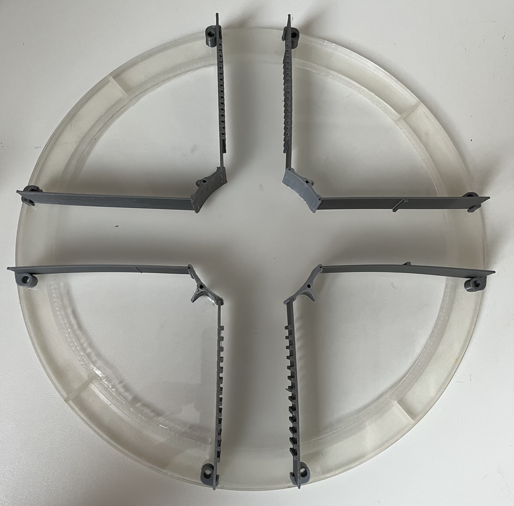

# Floating platform

There are several platforms you can use on the Airtrack. The size of the platform and the design of the upper part varies depending on your research question. 

#### Example platform for the large Airtrack

The ground platform design depends on the type or air table you are using. For small tables (not included in this guide), air is flowing directly and the platform needs to have a rim on its lower part. For large tables the platform should be completely flat because it presses down balls in the plexiglass surface. The balls are used to limit the air flow and by this the needed pressure is reduced to maintain the platform floating.

It's important to be aware about the influence of the material's surface to the mouse. The layer height in the print settings and the material used for the print are the main factors determining the surface's shape.
But a 3D printed platform has mostly a flat and slippery surface which doesn't allow the mouse to move as expected. It's recommended to attach some grips or slip-proof materials to allow the mouse to move naturally on the platform. A possible solution is a grip tape.

All recommended printing settings provided the best output on a FLASHFORGE CREATOR 3.

## Large platform {pagestep}

The components need to be printed independently and get glued afterwards.

We recommend to use a [plexiglass plate](plexiglass.yml#r300mmpg){Qty:1} with a diameter of 300mm as bottom plate. The other parts need to be glued on top of it as shown in the whole large platform STL. 

Instead of 3D printing, similar materials can be used, too.

#### Whole large platform
{color: grey}

#### Ground of large Platform
{color: grey}
#### Walls mounts of large platform 
Directly after printing, open the small gap to ensure the wall fits in between later. 
{color: grey}
#### Walls of large platform 
{color: grey}

#### Print settings:

Layer height: 0,15 mm

Infill: 60%

Nozzle size: 0,4 mm

Print speed: 60 mm/s

Temperatur (Nozzle/Platform): 200°C / 60°C 

Support: No

Print orientation: Platform parallel to ground

Material: PLA

Filament diameter: 1.75 mm

Retraction and extrude speed: 30 mm/s

Retraction distance: 1,3 mm

Raft: No

## Options for the ground of the large platform {pagestep}

If your 3D printer is to small to print the platform ground in one run or you don't want to print it, you could use other materials in the same size as platform. The platform ground only needs to be stiff, lightweight and with a diameter of 300mm. Further you need to glue things on it. The height is not relevant but should not exceed 10 mm. 

### Printing in segments
If your 3D printer is to small for printing the large platform in one run, you could print eight quarters of the platform and glue them.
Therefore use four quarters as one layer and glue them with the second layer by a overlap of 45° between quarters. 

The quality of this method mainly depends on how good you can remove a part from the printing bed. As this part is very thin, you need to take care to not change the proportions while removing the print from the bed.

You can use the [arcylic glue](tools.yml#acrifix_192){Qty: some, Cat:tool}[i](glueingadvise.md) for glueing the quarters.

{color: grey}

#### Print settings:

Layer height: 0,15 mm

Infill: 70%

Nozzle size: 0,4 mm

Print speed: 60 mm/s

Temperatur (Nozzle/Platform): 200°C / 60°C 

Support: No

Print orientation: Platform parallel to ground

Material: PLA

Filament diameter: 1.75 mm

Retraction and extrude speed: 30 mm/s

Retraction distance: 1,3 mm

Raft: No

## Additional information: small platform {pagestep}

The components need to be printed independently and get glued afterwards.
Instead of 3D printing, similar materials can be used, too.

#### Whole small platform
{color: grey}
#### Rim
{color: grey}
#### Ground of small Platform
{color: grey}
#### Walls of the small platform
{color: grey}
#### Wall mounts of the small platform
{color: grey}

#### Print settings:

Layer height: 0,15 mm

Infill: 60%

Nozzle size: 0,4 mm

Print speed: 60 mm/s

Temperatur (Nozzle/Platform): 200°C / 60°C 

Support: No

Print orientation: Platform parallel to ground

Material: PLA

Filament diameter: 1.75 mm

Retraction and extrude speed: 30 mm/s

Retraction distance: 1,3 mm

Raft: No

## Bottom side color for PixyCam detection {Pagestep}

In order to track the movement of the platform by the PixyCam the bottom side of the floating plate needs a pattern.

Therefor paint (e.g. with a dark permanent marker) a rectangle in the center of the platform with a edge length of 50 to 80 mm.

