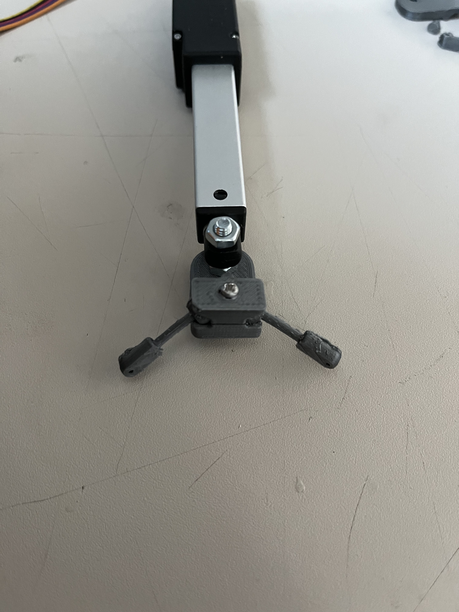
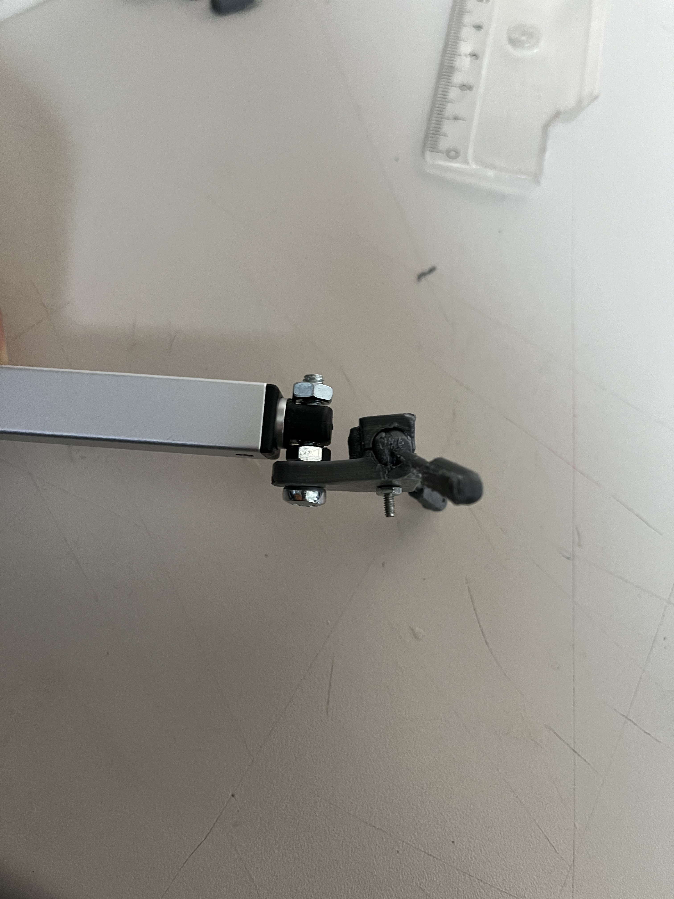

# Construction of the linear actuator front

Within this section a small hold for needles is built. It's placed at the front of the linear actuator and therefore can be moved towards the mouse if rewards should be provided. 

## Preparation: 3D prints {pagestep}

- Print all following parts, some need to be printed twice.
- It's recommended to print the "rotatable needle hold end" multiple times because the drilling inside is a bit tricky.

## Print core components {pagestep}

### Upper core

{color: grey}

### Lower core

{color: grey}

## Print rotatable needle hold (2x) {pagestep}

### Rotatable needle hold end
{color: grey}

### Rotatable needle hold core
{color: grey}

## Print needle fixation (2x) {pagestep}
{color: grey}

### Print settings

Print settings used for testing with a good result at a Creality Ender-3 V2

- Layer height: 0.12 mm
- Infill: 70%
- Nuzzle temperatur: 200°C
- Support: Yes, automatic from PrusaSlicer
- Raft: No

## After printing {pagestep}

- Use sandpaper to smooth both parts of the ball joint.
- Clean the holes inside the parts from blocking print artifacts and support structures, e.g. with a small drill.

- The "rotatable needle hold end" needs to have hole which is tight for a M2 screw. This hole is already in the STL files but gets filled with support most likely. 

    - Use a [1.5 mm drill](tools.yml#1_5mmdrill) to make a 5 mm deep hole, like in the STL file, and use a [2 mm drill](tools.yml#2mmdrill) to make the entrance larger, go like 1 mm inside. By this it's easier to insert the screw.

## Combine the 3D prints  {pagestep}

### An overview of all combined 3D printed parts

Use the overview as an orientation for combining.

{color: grey}

Do the following step twice: 

- Use a [M2 screw](screws.yml#m2x16mm_screw){Qty: 2} and place it trough the "rotatable needle hold core". Then turn the  "rotatable needle hold end" on the thread of the M2 screw.

Use a [M2 screw](screws.yml#m2x16mm_screw){Qty: 1} and a [M2 hexagon nuts](screws.yml#m2_hexagon_nuts){Qty: 1} to combine both core parts. 

- Before tighten the screw place both moveable needle holds with the ball inside. These should point sidewards and not to the front as shown in the file.

- Remember to loosen the screws before reorientating the moveable needle holds.

#### Combined needle hold
 

>i Note
>i
>i If the holes in the 3D printed parts are slightly to large for the needles and screws you can use [arcylic glue](tools.yml#acrifix_192) as support.

>i Note
>i
>i An alternative way of the rotatable needle hold is at the bottom of this page. It's a STL file with both parts of the rotatable needle hold and the combining screw. It can be printed by this as one part. With this version the arms a more elastic and can break.

## Attaching at the Linear actuator {pagestep}

- Use a [M4 screw](screws.yml#m4x20mm_screw){Qty: 1} and a [M4 hexagon nuts](screws.yml#m4_hexagon_nuts){Qty: 1} to combine the 3D printed component to the [linear actuator](electronic.yml#LinActuator50mm). 
    - The screw needs to go through the hole in the bigger core 3D part and the front hole of the moveable part of the linear actuator.

#### Two pictures of this state:

## Appendix - moveable needle hold parts:

{color: grey}

