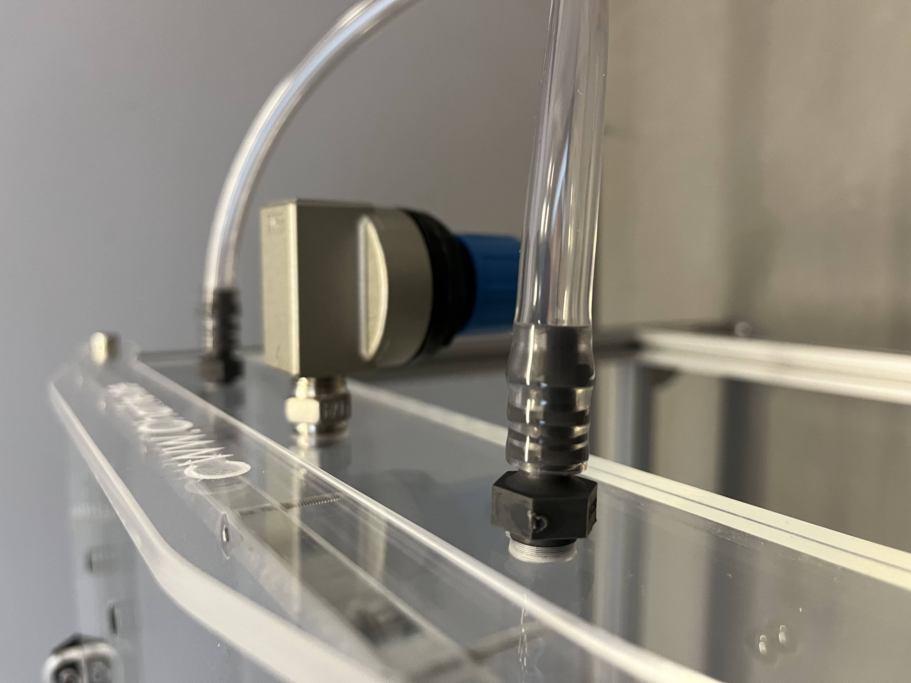

# Airtable part 5: Incoming air and pressure control

{{BOM}}

#### Picture of the pressure relief valve and incoming air pressure tubes

## Inserting of hose connection gland and pressure relief valve {pagestep}

These components take care of the incoming air and protect against overpressure.

- Choose one short side of the box and drill in the center of the the plexiglass a hole with a [G 1/4" thread drill](tools.yml#G1_4_thread_drill){qty:1, Cat:tool}. 

- Now insert the [reducing fitting](connectors.yml#R_1_4_R_1_4_reducing_fitting){Qty:1}. 

- Place with distance of 75 mm two more threads with a [G 1/8" thread drill](tools.yml#G1_8_thread_drill){qty:1, Cat:tool} on both side of the last thread. 

- Place inside these threads the [hose connection glands](connectors.yml#SV_Ges_8_R_1_8){Qty:2}. 

- Further place on the [reducing fitting](connectors.yml#R_1_4_R_1_4_reducing_fitting) the [pressure relief valve](connectors.yml#pressure_relief_valve){Qty:1}. 

## Air hose {pagestep}

- Combine two 200 mm [compressed air hose](connectors.yml#compressed_air_hose){Qty:2} with an [Y-hose connector](connectors.yml#YS_Ges_8){Qty:1}. 

- Append to the in one direction pointing end of the [Y-hose connector](connectors.yml#YS_Ges_8) another [compressed air hose](connectors.yml#compressed_air_hose) with the length of your need to the air pressure source. 

- Connect both 200 mm [compressed air hose](connectors.yml#compressed_air_hose) with the [hose connection glands](connectors.yml#SV_Ges_8_R_1_8).

You have build the [center air table]{output, qty:1} now.

