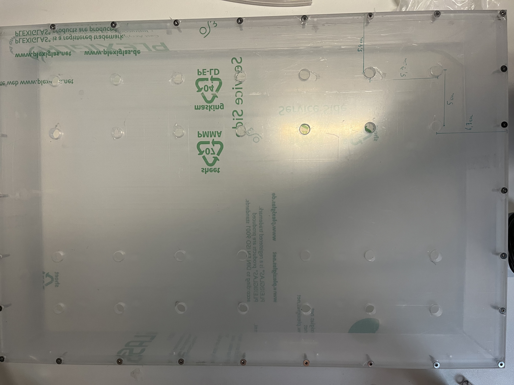

# Construction of the air table

## Predrill of Top plexiglass plates {pagestep}

- Drill 28 holes (0.8 cm diameter) into the [480mm x 326mm plexiglass plate](plexiglass.yml#480x326pg){Qty:1}, as shown in the following drawing.

     - 4 columns: 5.4, 10.4, 22.2, 27.2 cm of the border
     - 7 raws: 6.3, 12.2, 18.1, 24.0, 29.9, 36.8, 41.7 cm of the border

 
- Remove remains of drilling. 

- Now you have a [predrilled 480mm x 326mm plexiglass plate]{output, qty:1}. 

## Predrill lond sides {pagestep}

>!! **TODO**
>!!
>!! this is not understandable

To connect the air table with the table legs, the long side of the central box needs connection points. 

- Drill a hole on each end of both [480mm x 64mm plexiglass plates](plexiglass.yml#480x64pg)- {Qty:2} with a [5mm plexiglas drill](tools.yml#1mmdrill). 

- Keep a distance of 4.5 cm to the end edge and 1 cm to the top. 

- Drill two more holes inside both [480mm x 64mm plexiglass plates](plexiglass.yml#480x64pg) with a distance of 12.5cm towards the plate's center.

>!! **TODO**
>!!
>!! are they identical or symtrical ?
- Now you have two [predrilled 480x64 plexiglass plate]{output, qty:2}.

## Cleaning the plexiglass {pagestep}

Before beginning any gluing work, the pieces must be degreased (with soap and water) and free of any remaining screwing or other dirt.

## Glueing {pagestep}
>!! **TODO**
>!!
>!! always put reference for each part, not using made up names. Use the one created in the previous part of the doc.
>!! This needs pictures or schematics or video (and?)

The first step is to build the central plexiglas box where the air is floating through. 

- Use the acrylic glue to combine the predrilled [480mm x 326mm plexiglass plate](plexiglass.yml#480x326pg) with two [310mm x 64mm plexiglass plates](plexiglass.yml#310x64pg){Qty:2}. 
     - These are placed on the shorter edge of the [480mm x 326mm plexiglass plate](plexiglass.yml#480x326pg) with a space of 8mm on both sides. You are able to mark the corner spaces with a pen on the 8mm height of the largest plexiglas plate. 

- Use the [arcylic glue](tools.yml#acrifix_192) [i](glueingadvise.md) to connect the components. 

- Use the [arcylic glue](tools.yml#acrifix_192) [i](glueingadvise.md) to add the [480mm x 64mm plexiglass plates](plexiglass.yml#480x64pg).

     - Don't forget to put glue between both plexiglass components with 6.4 cm height. 

You now have the upper side of the air table center. The bottom plate will be glued later.

## Screwing {pagestep}

To further stabilize the box you need to drill screws from the side into the box from several places. 

- Every place for a screw must be predrilled with a [1mm plexiglas drill](tools.yml#1mmdrill).  

- Start with the long sides, predrill from the top into the upper plexiglas with a distance of 5.9 cm between each screw. 
    - The corner hole has a center distance of 4mm on both sides. 

- Continue with the short upper side, keep a distance of 5 cm between holes. The center hole has a distance of 5.9 cm to both neighbor screws

Now drill [3mm pozidriv screws](screws.yml#3mm_pozidriv){Qty:Many} in each hole.

## Glue bottom plate

The bottom plate is meant to disconnect first if the pressure in the box gets too high. Therefore the bottom plate is not screwed.

- Glue the not predrilled bottom plate [480mm x 326mm plexiglass plate](plexiglass.yml#480x326pg){Qty:1} below the box.

## Inserting of hose connection gland and pressure relief valve {pagestep}

These components take care of the incoming air and protect against overpressure.

- Choose one short side of the box and drill in the center of the the plexiglass a hole with a [G 1/4" thread drill](tools.yml#G1_4_thread_drill). 

- Now insert the [reducing fitting](connectors.yml#R_1_4_R_1_4_reducing_fitting){Qty:1}. Place with distance of 7,5cm two more threads with a [G 1/8" thread drill](tools.yml#G1_8_thread_drill) on both side of the last thread. 

- Place inside these threads the [hose connection glands](connectors.yml#SV_Ges_8_R_1_8){Qty:2}. You can place on the [reducing fitting](connectors.yml#R_1_4_R_1_4_reducing_fitting) the [pressure relief valve](connectors.yml#pressure_relief_valve){Qty:1}. 

    - It's recommended to remove it during works on the Airtable. 

- Further combine two 20cm [compressed air hose](connectors.yml#compressed_air_hose){Qty:many} with an [Y-hose connector](connectors.yml#YS_Ges_8){Qty:1}. 
    - Append to the in one direction pointing end of the [Y-hose connector](connectors.yml#YS_Ges_8) another [compressed air hose](connectors.yml#compressed_air_hose) with the length of your need. 

- Connect both 20cm [compressed air hose](connectors.yml#compressed_air_hose) with the [hose connection glands](connectors.yml#SV_Ges_8_R_1_8).

You have build the [air table center box]{output, qty:1} now.

