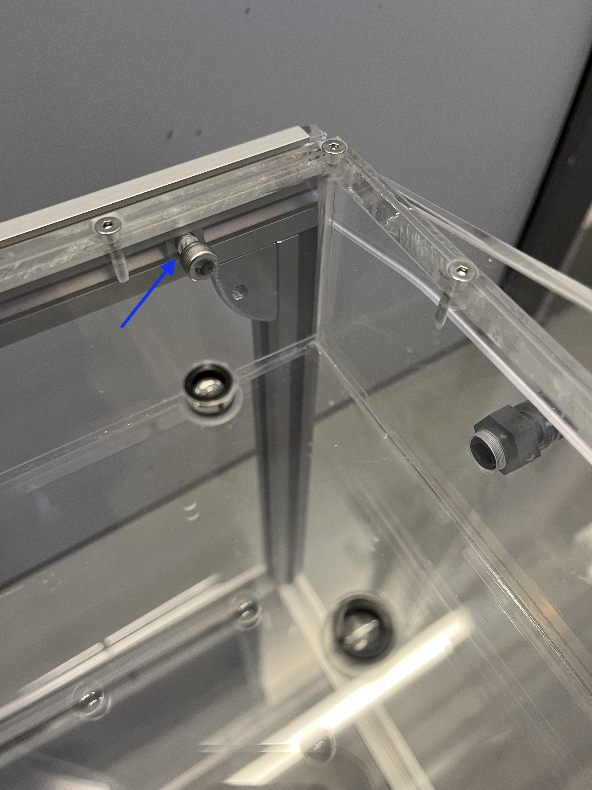
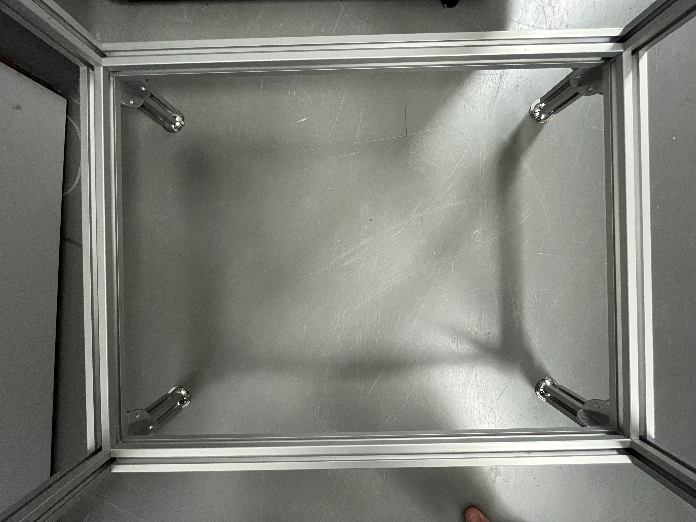

# Construction of the framework

{{BOM}}

Now you're going to fix the [air table center box](fromstep){Qty:1} with a surrounding framework, so it stands.

## U-formation framework {pagestep}

We will first build two U-shaped framework which will be connected to the airtable using the holes we prepared during the predrilling stage. Accordingly the central part of the "U" should be 480 mm.
You can decide of the length of the other two elements that will become the feets of the table.
We usually use 400 mm, and if should not be less than 250 mm to get enough distance for the camera fixed below. 

- Cut the [aluminium strut profile](framework.yml#20x20Rod){qty: some} into two 480 mm pieces and four pieces of equal length > 250 mm (recommended length 400 mm, see above).

 
<<<<<<< Updated upstream
=======

- Place two [nuts](connectors.yml#5mmNuts){Qty:4} inside two [aluminium strut profile](framework.yml#20x20Rod) pieces used as feets, fixate on each an [angle](connectors.yml#5mmNuts_angle){Qty:4} with a [M5 screw (6mm)](screws.yml#m5x6mm_screw){Qty:4} at one end. Now connect both with the 480 mm long [aluminium strut profile](framework.yml#20x20Rod) by using [nuts](connectors.yml#5mmNuts){Qty:4} and a [M5 screw (6mm)](screws.yml#m5x6mm_screw){Qty:4}.
- Repeat the previous step with the remaining 3 struts.

>!! **TODO**
>!!
>!! are numbers of parts correct ?
>!!
>!! yes, it s done twice
>>>>>>> Stashed changes

- Place two [nuts](connectors.yml#5mmNuts){Qty:4} inside two [aluminium strut profile](framework.yml#20x20Rod) pieces used as feets, fixate on each an [angle](connectors.yml#5mmNuts_angle){Qty:4} with a [M5 screw (6mm)](screws.yml#m5x6mm_screw){Qty:4} at one end. Now connect both with the 480 mm long [aluminium strut profile](framework.yml#20x20Rod) by using [nuts](connectors.yml#5mmNuts){Qty:4} and a [M5 screw (6mm)](screws.yml#m5x6mm_screw){Qty:4}.
- Repeat the previous step with the remaining 3 struts.

<<<<<<< Updated upstream
>!! **TODO**
>!!
>!! are numbers of parts correct ?

## Fixing the U-formation framework to the central air table {pagestep}

>!! **TODO**
>!!
>!! I do not understand, add photos.
=======
## Fixing the U-formation framework to the central air table {pagestep}

>!! **TODO**
>!!
>!! I do not understand, add photos.

In this set we will attach the blue marked frame to the air table box.
>>>>>>> Stashed changes

- Place two [nuts](connectors.yml#5mmNuts){Qty:4} inside each 480 mm rod of the U-formation frameworks on one side which adjacent to the side with nuts already placed in (90 degrees to both rods which can vary in length), both sides work. 
- Now line these nuts up with the holes inside the long sides of the air table (480mm) 

- The holes in the 480mm x 326mm plexiglass plate of the airtable need to point in the opposite direction as the two rods which can vary in length.

- Connect the air table box and the U-formation framework with two [M5x12mm screws](screws.yml#m5x12mm_screw){Qty:4} from the inside of the air box in each nut. 

Repeat this step with the second U-formation framework on the other side of the air table box.

## Attach a second frame circle {pagestep}

To guarantee a higher stability it's recommended to place a second framework circle 5-10cm above the ground. The second framework circle is shown in the picture below.

<<<<<<< Updated upstream
- Therefore cut the [aluminium strut profile](framework.yml#20x20Rod) in two pieces with a length of 440 mm and three with a length of 326 mm. 

- Place on both ends of each [aluminium strut profile](framework.yml#20x20Rod) a [nuts](connectors.yml#5mmNuts){Qty:10}. 

- Put an extra [nuts](connectors.yml#5mmNuts){Qty:2} in the 440 mm [aluminium strut profile](framework.yml#20x20Rod). It will point to the center later. 

=======

- Therefore cut the [aluminium strut profile](framework.yml#20x20Rod) in two pieces with a length of 440 mm and three with a length of 326 mm. 

- Place on both ends of each [aluminium strut profile](framework.yml#20x20Rod) a [nuts](connectors.yml#5mmNuts){Qty:10}. 

- Put an extra [nuts](connectors.yml#5mmNuts){Qty:2} in the 440 mm [aluminium strut profile](framework.yml#20x20Rod). It will point to the center later. 

>>>>>>> Stashed changes
- Connect the [nuts](connectors.yml#5mmNuts) and an [angle](connectors.yml#5mmNuts_angle){Qty:10} with a [M5 screw (6mm)](screws.yml#m5x6mm_screw){Qty:10}. Place [nuts](connectors.yml#5mmNuts){Qty:8} at the wished height inside the to the Airtable mounted [aluminium strut profile](framework.yml#20x20Rod). 

- Now connect the [aluminium strut profiles ](framework.yml#20x20Rod) with [angles](connectors.yml#5mmNuts_angle) to the at the Airtable mounted [aluminium strut profile](framework.yml#20x20Rod) with a [M5 screw (6mm)](screws.yml#m5x6mm_screw){Qty:8}. 

- Put two [nuts](connectors.yml#5mmNuts){Qty:2} inside the third 326 mm [aluminium strut profile](framework.yml#20x20Rod). These both need to point upwards in the next step.

- Place the third 326 mm [aluminium strut profile](framework.yml#20x20Rod) in the center at the two unused nuts and connect it with two more [M5 screw (6mm)](screws.yml#m5x6mm_screw){Qty:2}. 

>! picture

## Glueing of the bottom plate {pagestep}

After connecting the air table with the framework there is no need in accessing the inner box. 

- Again it's necessary to degrease and remove any dirt at the glueing surface before glueing.

- [Glue](tools.yml#acrifix_192) the second 480mm x 326mm plexiglass plate on the bottom side of the already build. Line up the long side of the box with the long side of the plate, there must be no hole for air flowing through. 

>!! **TODO**
>!!
>!! I do not understand, add photos.

You have build the [center air table]{output, qty:1} now.

## Some pictures of this state

>!! **TODO**
>!!
>!! Put images in the right places, add a caption for each image.

