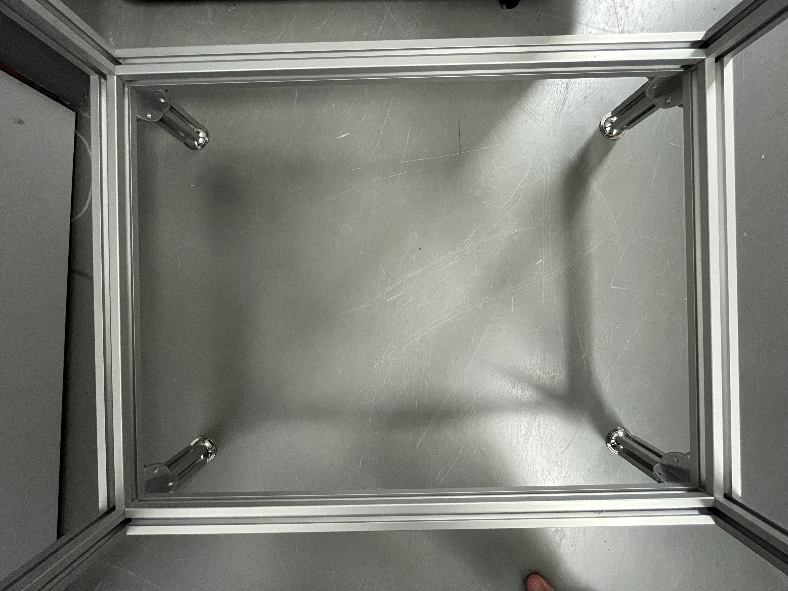
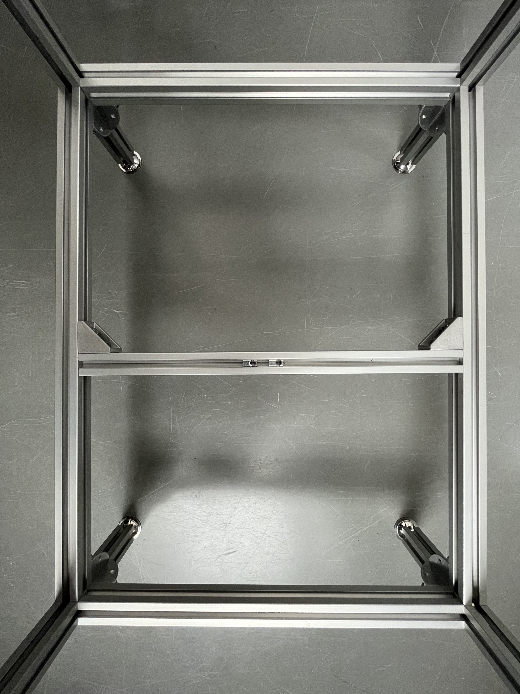

# Airtable part 4: Construction of the framework

{{BOM}}

Now you're going to fix the [air table center box](fromstep){Qty:1} with a surrounding framework, so it stands.

## U-formation framework {pagestep}

We will first build two U-shaped framework which will be connected to the airtable using the holes we prepared during the predrilling stage. Accordingly the central part of the "U" should be 480 mm.
You can decide of the length of the other two elements that will become the feets of the table.
We usually use 400 mm, and if should not be less than 250 mm to get enough distance for the camera fixed below. 

 

- Place one [nut](connectors.yml#5mmNuts){Qty:4} inside each of four [aluminium strut profiles (length: 400mm)](fromstep){Qty:4} used as feets. 
- Fixate on each an [angle](connectors.yml#5mmNuts_angle){Qty:4} with a [M5 screw (6mm)](screws.yml#m5x6mm_screw){Qty:4} at one end of the strut. 
-  Do this twice: Connect two of the four struts with a nut and angle with one of the 480 mm long [aluminium strut profiles (length: 480mm)](fromstep){Qty:2} by using [nut](connectors.yml#5mmNuts){Qty:4} and a [M5 screw (6mm)](screws.yml#m5x6mm_screw){Qty:4}.
    - Both short (400 mm) struts need to point in the same direction

## Fixing the U-formation framework to the central air table {pagestep}

In this set we will attach the frame (blue marked in the picture above)  to the air table box.

- Place four [nut](connectors.yml#5mmNuts){Qty:8}s inside each 480 mm rod of the U-formation frameworks on one side which adjacent to the side with nuts already placed in (90 degrees to both rods which can vary in length), both sides work. 
- Now line these nuts up with the holes inside the long side plates of the air table box (480mm) 

- The holes in the 480mm x 326mm plexiglass plate of the airtable need to point in the opposite direction as the two rods which can vary in length.

- Connect the air table box and the U-formation framework with four [M5 screw (12mm)](screws.yml#m5x12mm_screw){Qty:8} from the inside of the air box in each nut. 

Repeat this step with the second U-formation framework on the other side of the air table box.

## Attach a second frame circle {pagestep}

To guarantee a higher stability it's recommended to place a second framework circle 5-10cm above the ground. The second framework circle is shown in the picture below.

#### Picture of the second frame circle

- Install [angle](connectors.yml#5mmNuts_angle){Qty:8} with a [M5 screw (6mm)](screws.yml#m5x6mm_screw){Qty:8} and 
[nut](connectors.yml#5mmNuts){Qty:8}s on the ends of two [aluminium strut profiles (length: 440mm)](fromstep){Qty:2} and two [aluminium strut profiles (length: 286mm)](fromstep){Qty:2}.

- Put an extra [nut](connectors.yml#5mmNuts){Qty:2} in both 440 mm aluminium strut profiles. It must point to the center later (90° shifted from the other two nuts). This will be used to add an horizontal strut later on.

- Connects these stuts with the table feets using [nut](connectors.yml#5mmNuts){Qty:8} and [M5 screw (6mm)](screws.yml#m5x6mm_screw){Qty:8}, placed at the wished height (10 mm works). The angle should be place below the horizontal stuts.

>i **Note** 
>i
>i The following strut is only needed if you want to place the camera on it, it does not have a stability purpose

- Put two [nut](connectors.yml#5mmNuts){Qty:2} inside the third of the  [aluminium strut profiles (length: 286mm)](fromstep){Qty:1}. These nuts need to point upwards in the next step.

- Place a third 326 mm [aluminium strut profile](framework.yml#20x20Rod) in the center at the two unused nuts and connect it with two [angle](connectors.yml#5mmNuts_angle){Qty: 2}s and two more [M5 screw (6mm)](screws.yml#m5x6mm_screw){Qty:2}s. 

## Glueing of the bottom plate {pagestep}

After connecting the air table with the framework there is no need in accessing the inner box, so we can close the box. The bottom plate is meant to disconnect first if the pressure in the box gets too high. Therefore the bottom plate is not screwed.

- Again it's necessary to degrease and remove any dirt at the glueing surface before glueing.

- Line up the long side of the box with the long side of the plate, there must be no hole for air flowing through.

- [Glue (acrylic glue)](tools.yml#acrifix_192){Qty: Some, Cat:tool}[i](glueingadvise.md) the not predrilled bottom [480mm x 326mm plexiglass plate](plexiglass.yml#480x326pg){Qty:1} below the table box. It's recommended to put the glue on the 8 mm wide sides and not on the bottom plate.

Wait for the glue to be dry before going to the next step.

