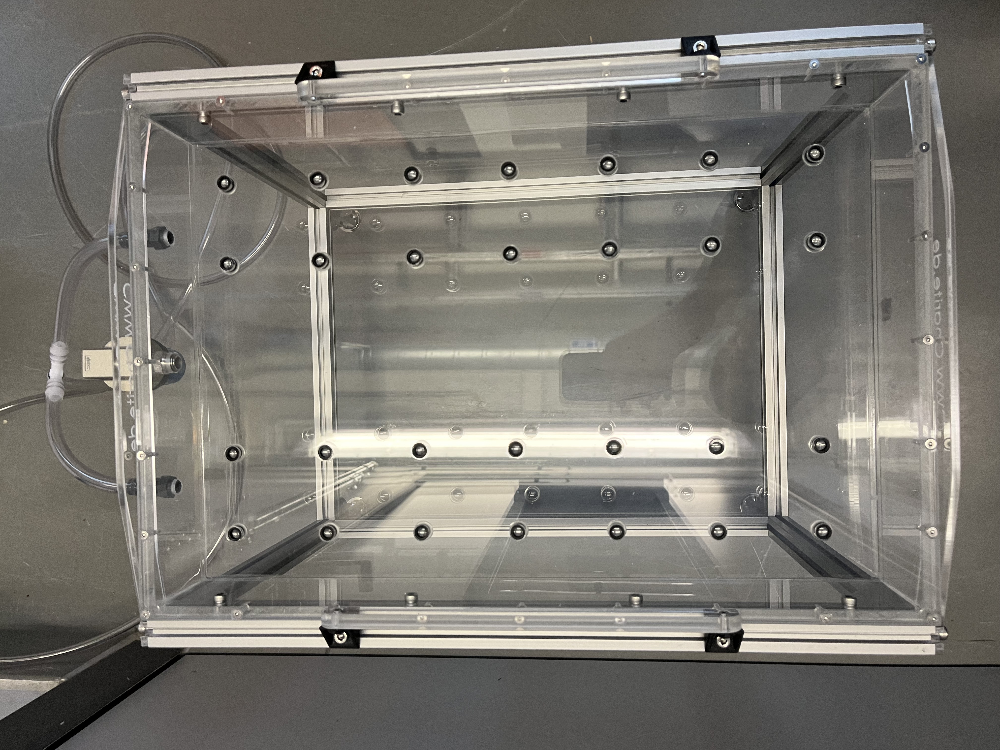
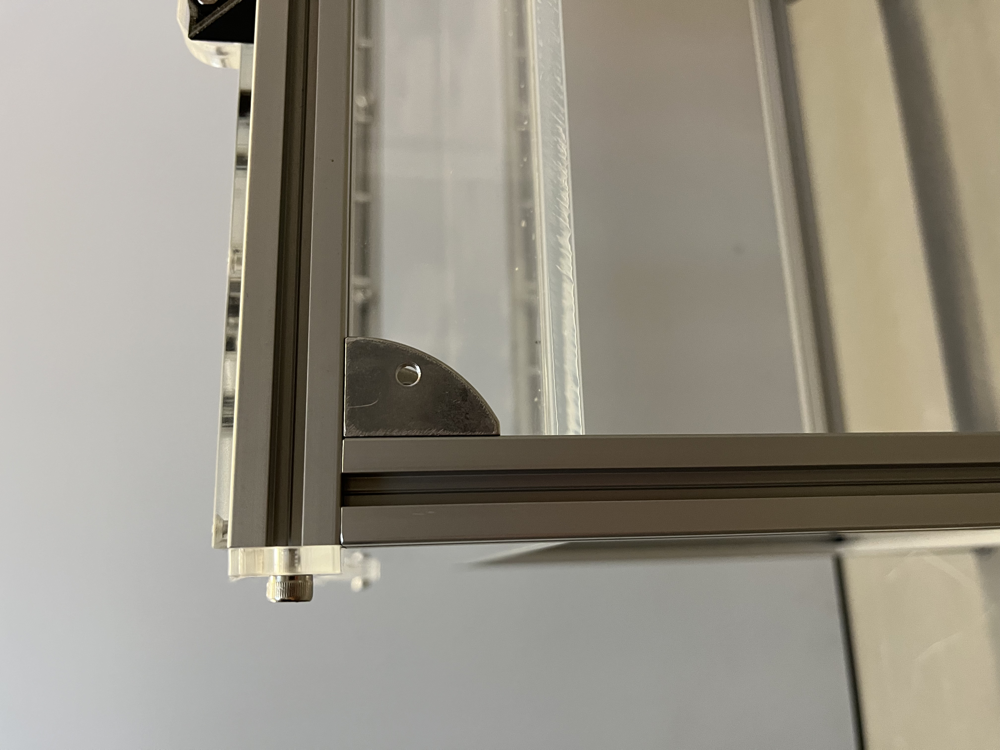
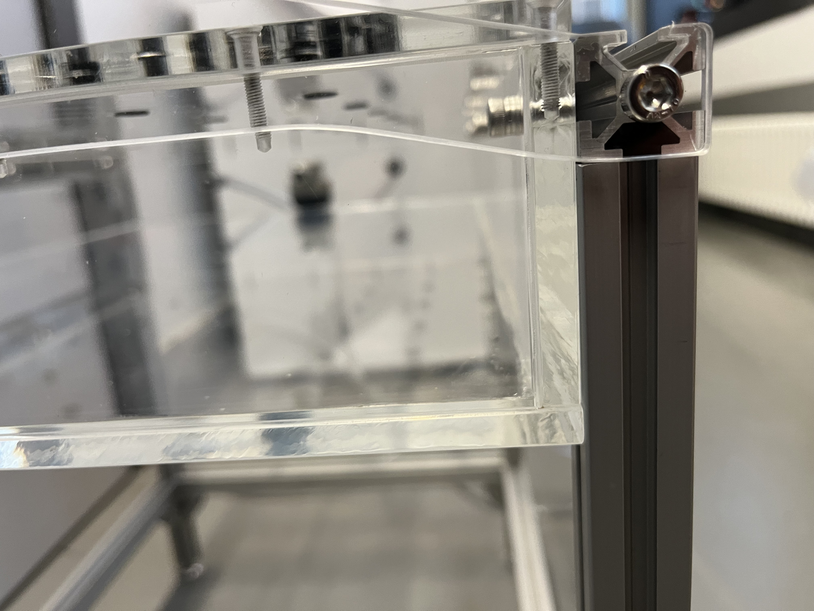
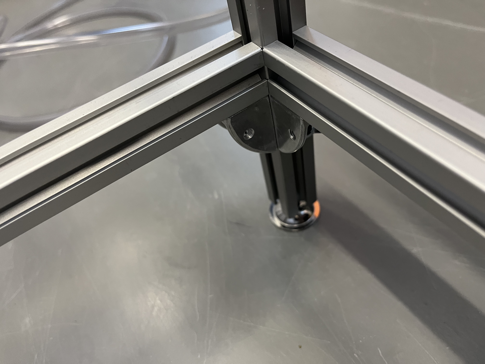
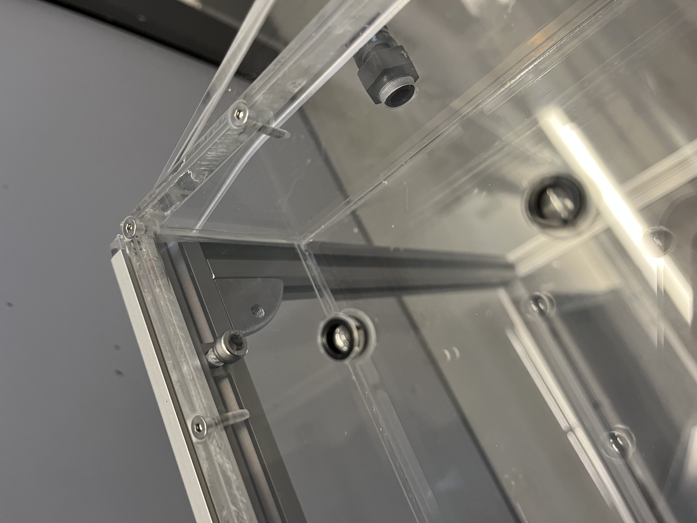
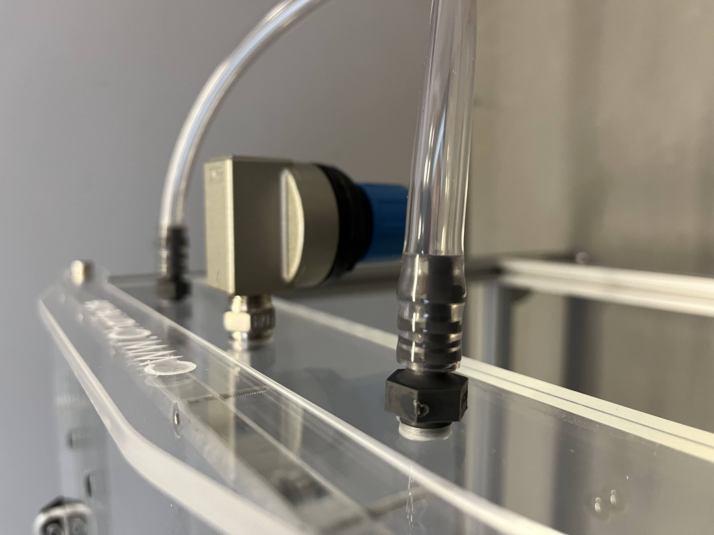

# Construction of the framework

Now you're going to connect the [air table center box](fromstep){Qty:1} with the surrounding framework.

## U-formation framework {pagestep}

Cut the [aluminium strut profile](framework.yml#20x20Rod) into two 48cm pieces and four pieces with a minimum of 20cm with a [metallsaw](tools.yml#metallsaw). The length of the four pieces is depending on your height preferences. A minimum of 25 cm is needed to have enough space for the camera below the table. The recommended length is 40cm. 
The following is done twice. 
Place two [nuts](connectors.yml#5mmNuts){Qty:4} inside the two [aluminium strut profile](framework.yml#20x20Rod) pieces with variable length, fixate on each a [angle](connectors.yml#5mmNuts_angle){Qty:4} with a [M5 screw (6mm)](screws.yml#m5x6mm_screw){Qty:4} at one end. Now connect both with the 48 cm long [aluminium strut profile](framework.yml#20x20Rod) by using a [nuts](connectors.yml#5mmNuts){Qty:4} and a [M5 screw (6mm)](screws.yml#m5x6mm_screw){Qty:4}.

## Applying the U-formation framework to the central air table {pagestep}

Place two [nuts](connectors.yml#5mmNuts){Qty:4} inside each 48 cm rod of the U-formation frameworks on one side which adjacent to the side with nuts already placed in (90 degrees to both rods which can vary in length), both sides work. Now line these nuts up with the holes inside [480mm x 64mm plexiglass plates](plexiglass.yml#480x64pg) of the central air table box. The holes in the [480mm x 326mm plexiglass plate](plexiglass.yml#480x326pg) need to point in the opposite direction as the two rods which can vary in length.
Connect the air table box and the U-formation framework with two [M5x12mm screws](screws.yml#m5x12mm_screw){Qty:4} from the inside of the air box in each nut. 

Repeat this step with the second U-formation framework on the other side of the air table box.

## Attach a second frame circle {pagestep}

To guarantee a higher stability it's recommended to place a second circle 5-10cm above the ground.

Therefore cut the [aluminium strut profile](framework.yml#20x20Rod) in two pieces with a length of 44cm and two with a length of 32.6cm. Place on both ends of each [aluminium strut profile](framework.yml#20x20Rod) a [nut](connectors.yml#5mmNuts){Qty:8}. Connect the [nut](connectors.yml#5mmNuts) and an [angle](connectors.yml#5mmNuts_angle){Qty:8} with a [M5 screw (6mm)](screws.yml#m5x6mm_screw){Qty:8}. Place [nuts](connectors.yml#5mmNuts) at the wished height inside the to the Airtable mounted [aluminium strut profile](framework.yml#20x20Rod). Now connect the [aluminium strut profiles ](framework.yml#20x20Rod) with angles and the to the Airtable mounted [aluminium strut profile](framework.yml#20x20Rod) with a [M5 screw (6mm)](screws.yml#m5x6mm_screw){Qty:8}.

## Glueing of the bottom plate {pagestep}

After connecting the air table with the framework there is no need in accessing the inner box. Now [glue](tools.yml#acrifix_192) the second [480mm x 326mm plexiglass plate](plexiglass.yml#480x326pg){Qty:1} on the bottom side of the already build. Line up the long side of the box with the long side of the plate, there must be no hole for air flowing through. Again it's necessary to degrease and remove any dirt at the glueing surface before glueing.

You have build the [center air table]{output, qty:1} now.

## Some pictures of this state

# Note
[M5 screw (6mm)](screws.yml#m5x6mm_screw) and [nut](connectors.yml#5mmNuts) to be exchanged. Further testing needed.