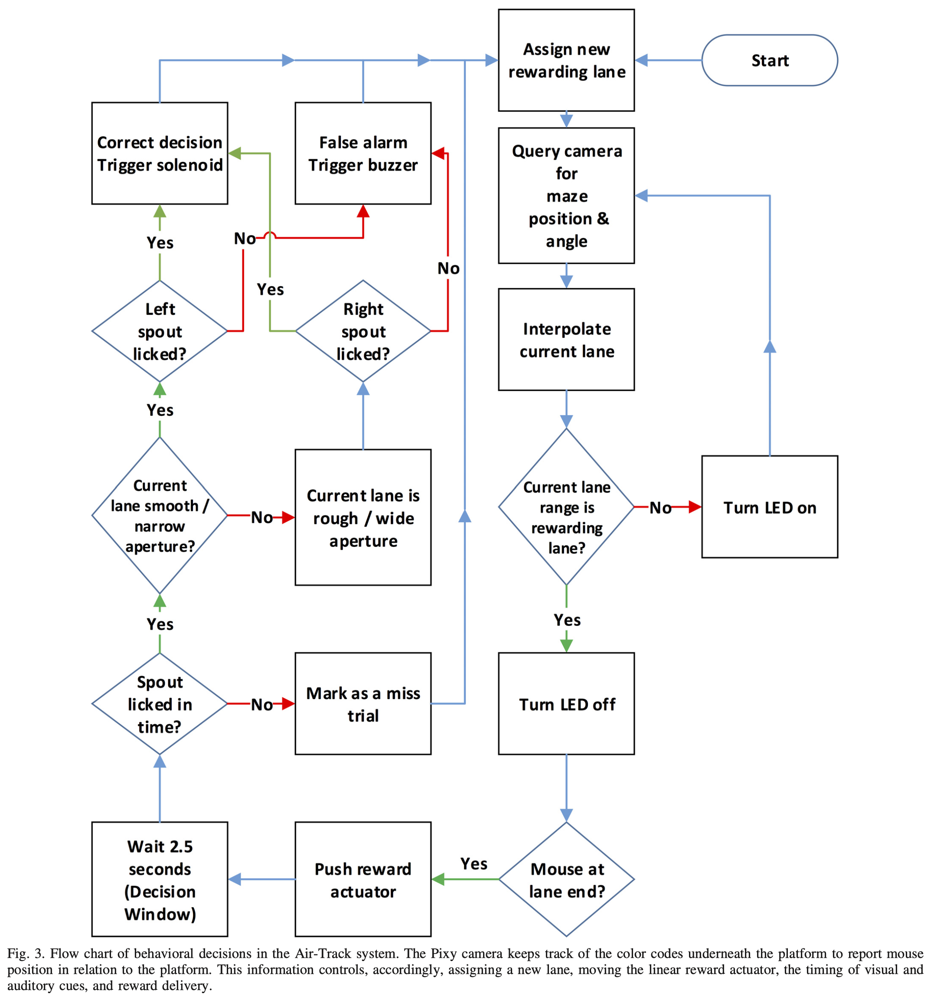

# Electronics part 4: Arduino code guide

The provided code handles a complex workflow. It tracks the position of the mouse and provides positional feedback and rewards. This process requires several external components which are set up at the start of the script. If errors arise, it's most likely within this section. 

For debugging you need to implement several print messages and check which get outputted and which not.

- There are currently the main important prints to check the functionality implemented. You can enable them by setting the variable test_run to "true". This variable is located at the top of the ".ino" file. 
    - If all messages get printed, the set up should work as intended. 
    - Additionally, you can test it by moving the platform until the prints state to be in the reward lane. These prints are always enabled. 

- You might need some extra debugging if unexpected errors occur.
    -  Code example for additional printing: Serial.print("Start sensor setup  ");

### Test run  {pagestep}

You can test the functionality by moving the platform until the prints state to be in the reward lane. These prints are always enabled. 

- Imagine to be a head fixed mouse while moving the platform. 

- Depending on the choice of the lick spot a reward should be provided or not. 

- Below you can view the hole workflow as displayed in the paper   [Air-Track: a real-world floating environment for active sensing in head-fixed mice](https://doi.org/10.1152/jn.00088.2016) in figure 3.

### Capacitive sensor MPR121  {pagestep}

- To test the functionality of the MPR121 use the test.ino provided in the Github repository 

- https://github.com/adafruit/Adafruit_MPR121/blob/master/examples/MPR121test/MPR121test.ino

- To change the threshold for touch and release you need to adjust these both values in the sensor.h. The thresholds are stored in hexadecimal:
    - define NEW_TOU_THRESH 0x02
    - define NEW_REL_THRESH 0x35

- Depending on your wiring the MPR121 will register more or less contacts. You might need to change the thresholds.
    - These values can be found in the definitions.h file starting with "static const long int SAME_SENSOR_MAX_THRESHOLD = 500;"

### Test Pixycam2 {pagestep}

- To test the Pixycam2 select within the Arduino IDE file -> examples -> Pixy2 -> ccc_hello_world

- The program permanently prints if it detects a specified object and includes the parameters

### Adjust pixel values in code {pagestep}

Depending on the position of your camera you need to adjust the pixel values for the tracked platform in the code.

- The minimal and maximal x and y values specify the pixels in the camera view where the center of the platform is if the mouse is in a lane.
    - These values can be found in the definitions.h file starting with "DistancesStruct ()"

- Use the "ccc_hello_world" to determine pixel values of the area 

### Linear actuator {pagestep}

- The airtrack code Github repository contains a linear actuator moving file which also can be used to test it

- The default mode of the code is to pull

