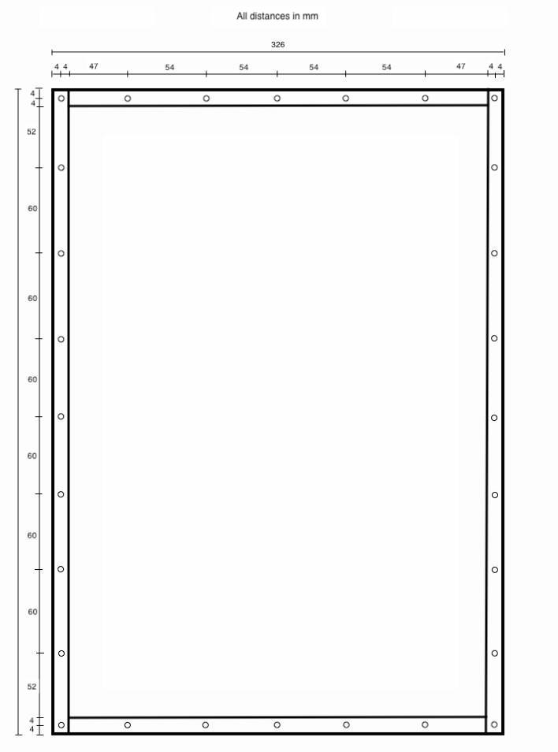

# Airtable part 3: Glueing and screwing

{{BOM}}

>!! **TODO**
>!!
>!! first glue or screw?
>!! I think screwing while the ghlue drys

## Predrill side plexiglass plates {pagestep}

Use the following drawing as an orientation to predrill both [310mm x 64mm plexiglass plates](plexiglass.yml#310x64pg){Qty:2} and both [predrilled 480x64 plexiglass plate](fromstep){qty:2}. 
The drawing is looking from the top at the plexiglasses. Keep in mind the orientation of the [predrilled 480x64 plexiglass plate](fromstep). It's earlier holes should be close to the upper side.

#### Constructional drawing (distances in millimeter)
- Use a [1mm plexiglas drill](tools.yml#1mmdrill){qty: one,cat:tool} for drilling.

## Glueing {pagestep}

The next step is to glue the central plexiglas box where the air is floating through. Try to keep the predrilled holes free of glue. It's recommended to place the glue on the 8 mm wide sides of the plexiglass.

- Use the [arcylic glue](tools.yml#acrifix_192){qty:some, Cat:tool}[i](glueingadvise.md) to combine the [predrilled 480mmx326mm plexiglass plate](fromstep){Qty:1} with two [310mm x 64mm plexiglass plates](plexiglass.yml#310x64pg), on the shorter edges. 8 mm should remain on both sides. 

- Use the [arcylic glue](tools.yml#acrifix_192) [i](glueingadvise.md) to add the [predrilled 480x64 plexiglass plate](fromstep). Put some glue on the 3 edges touching other plexiglas plates.

Wait for the glue to be dry before going to the next step.

## Screwing {pagestep}

To further stabilize the box you need to drill screws from the top into the side plexiglass from several places. All holes are all ready predrilled. 

- Put a [3mm pozidriv screws](screws.yml#3mm_pozidriv){Qty:26} in each hole which is shown in the drawing from step 1 on this page. 

You have build the [air table center box]{output, qty:1} now.

