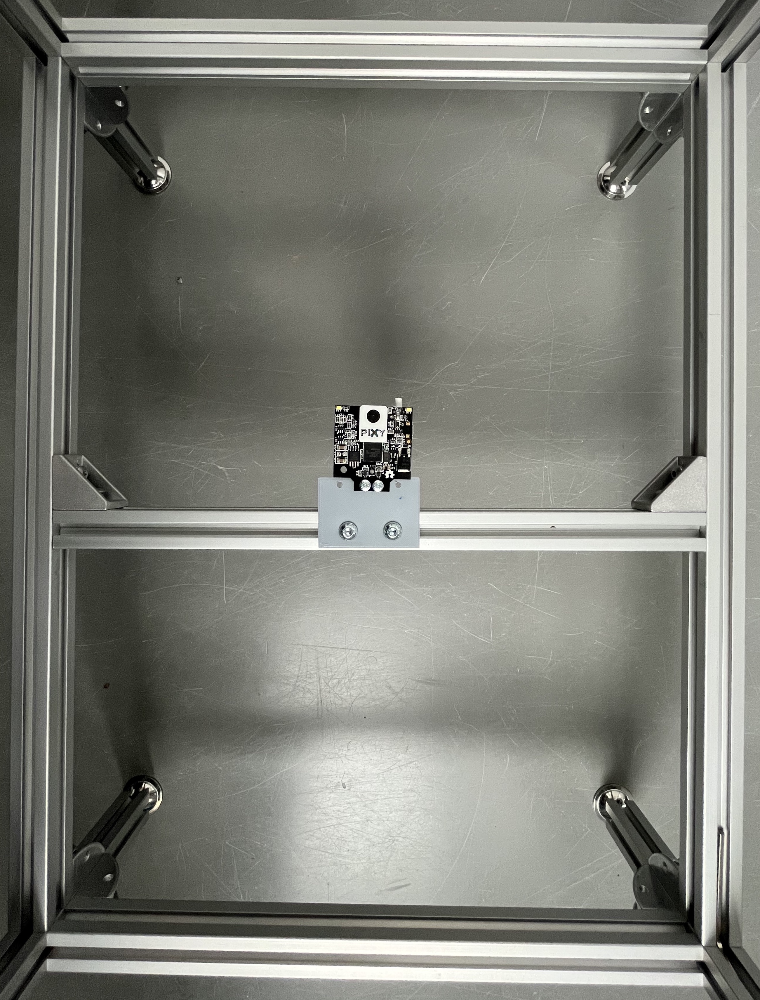

# Attaching the camera

This page presents how to set a pixie camera below the setup. The camera should be far enough to record the whole bottom of the air table box. 
{{BOM}}

## 3D print {pagestep}

- 3D print the following file: 
    - Settings: [i](3D_settings_plate.md)
{color: grey}

## Setup / placement {pagestep}
- Place the two [nuts](connectors.yml#5mmNuts){Qty:2}, which are already in the lower center [aluminium strut profile](framework.yml#20x20Rod), with a distance of 35 mm. 

#### Placement of nuts in lower center strut

- Mark two points with the distance of the threads on the 1.5mm plate 3D printed plate along one long side with 5 to 10 mm distance from the edge. 

- Drill holes with a [5mm drill](tools.yml#5mmdrill){qty:1, Cat:tool} at both places.

- Take the [Pixy Camera](electronic.yml#PixyCam){qty:1} to mark on the other long side two more drill places with the distance of both holes from the fixation part of the [Pixy Camera](electronic.yml#PixyCam). The distance should be around 7 mm.

- Drill holes with a [3mm drill](tools.yml#3mmdrill){qty:1, Cat:tool} at both places.

- Connect the 3.5mm plate by using [M5 screws](screws.yml#m5x6mm_screw){Qty: 2} with the [aluminium strut profile](framework.yml#20x20Rod).

- Connect the [Pixy Camera](electronic.yml#PixyCam) to the 1.5mm plate by using [M3 screws](screws.yml#m3x5mm_screw){Qty: 2} and [M3 hexagon nuts](screws.yml#m3_hexagon_nuts){Qty: 2}.

You might need to shift the [aluminium strut profile](framework.yml#20x20Rod) in the center a bit to have the [Pixy Camera](electronic.yml#PixyCam) in the center.

#### Picture of the below the table placed camera

