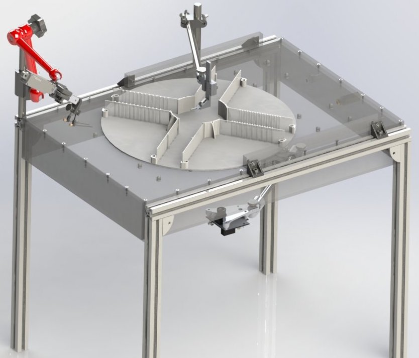

# Construction guidance of an Airtrack

This website will guide you through the hole process of building an Airtrack by yourself. This guide is part of the output from the [open.make project] (https://www.openmake.de/). This project aims to further establish open hardware in science e.g. by supporting scientist replicating research and providing guides to research hardware. The Airtrack was first published in the paper titled [Air-Track: a real-world floating environment for active sensing in head-fixed mice in Journal of Neurophysiology 1 October 2016 Vol. 116](https://pubmed.ncbi.nlm.nih.gov/27486102/). It was developed within Larkum Lab by Mostafa Nashaat, Hatem Oraby, Robert Sachdev, York Winter and Matthew Larkum as well as Alexander Schill from the Charite Workshop. 
Further Information is provided on the website of the [Airtrack](http://www.neuro-airtrack.com/).

## Table of contents

#### [Construction of the airtable](airtable.md){step}

#### [Construction of the basic framework](basicframework.md){step}

#### [Construction of the head fixation and platform tracking](headandcamera.md){step}

#### [Construction of the rewarding system](rewardsystem.md){step}

#### [Setup of the electronics](electronics.md){step}

#### [List of all necessary components]{BOM}

### About the Airtrack

To investigate the neuronal activities in ordinary behaviour it's eligible to implement modern brain recording equipment. These modern technics frequently require head fixation. The Airtrack is one approach to facilitate analysing natural behaviour in its complexity. Behaviour is depended on permanent sensory feedback from various modalities and this sensory perception is the central challenge to provide in its totality. The Airtrack aims to provide these in combination with a simple setup and low costs. The Airtrack consists out of a central air table with the possibility of modification. In the first version a mouse moved on a floating plus maze while being head fixed on the center above the platform. Below the table a camera tracked the movement of the plus maze and at one side of the table a reward system was placed. This setup is shown in the picture below.

Source ???

