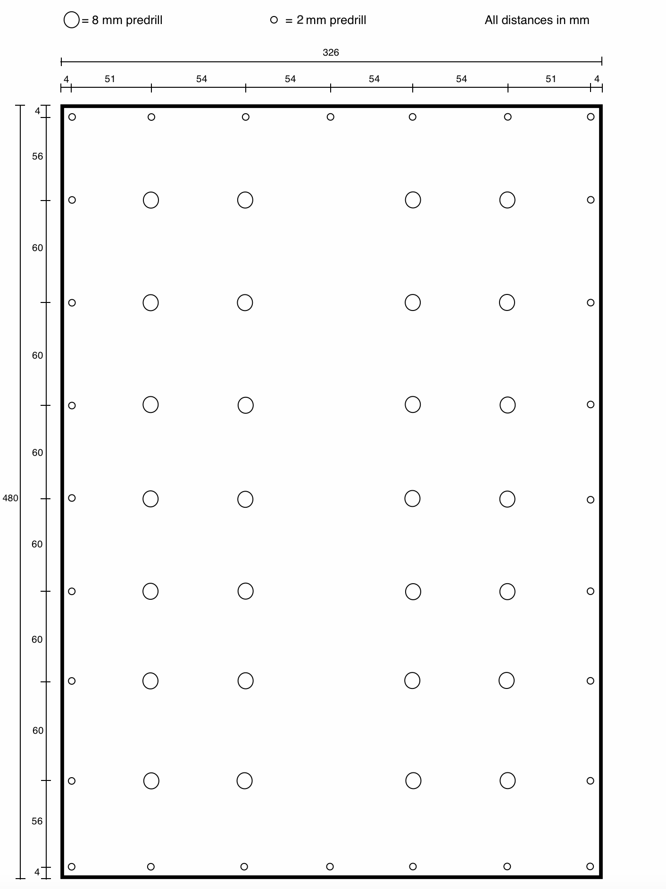
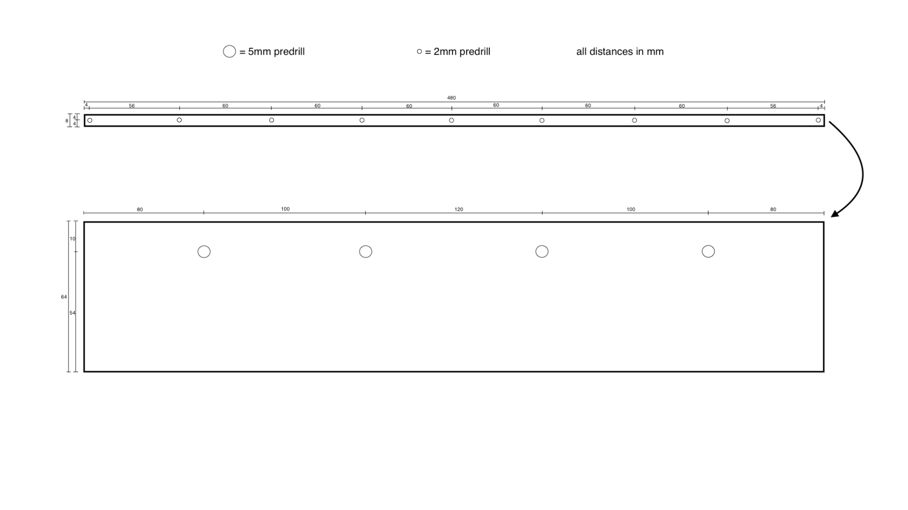
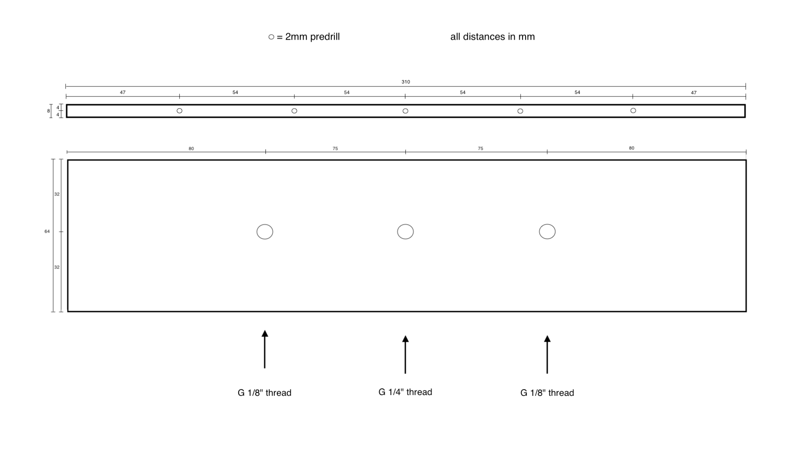
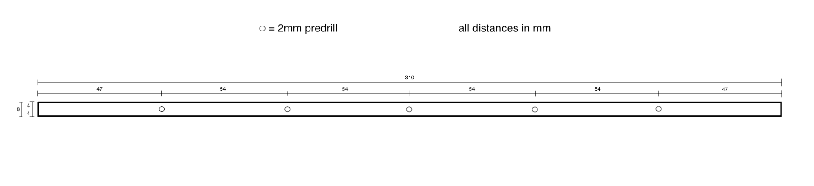

# Airtable part 2: Predrill

{{BOM}}

The box will be made of one top, one bottom, 2 long sides and 2 short sides. In this step, we will drill holes in the top, short and long sides plexiglass plates.

>i **Note** 
>i
>i All constructional drawings have a higher resolution if you open them in a new tab.

## Predrill of Top plexiglass plates {pagestep}

- Drill 28 holes (8 mm diameter) into the [480mm x 326mm plexiglass plate](plexiglass.yml#480x326pg){Qty:1}, as shown in the following drawing, with a [8mm plexiglas drill](tools.yml#8mmdrill){Qty: 1, Cat: Tool}. They will be used for ball valves. 

- Additional drill 28 holes (3 mm diameter) through the [480mm x 326mm plexiglass plate](plexiglass.yml#480x326pg){Qty:0}, as shown in the following drawing, with a [3mm plexiglas drill](tools.yml#3mmdrill){Qty: 1, Cat: Tool}. Each of this holes will later be on top of the 2mm pilot holes in the side plates. 

#### Constructional drawing top plate (distances in millimeter)  

## Predrill long sides {pagestep}

To connect the air table with the table legs, the long sides ([480mm x 64mm plexiglass plates](plexiglass.yml#480x64pg)) of the central box needs connection points. Besides the long sides need pilot holes for connecting it with the top plate.

- Drill four holes with a [5mm plexiglas drill](tools.yml#5mmdrill){Qty: 1, Cat: Tool} in each of the two [480mm x 64mm plexiglass plates](plexiglass.yml#480x64pg){Qty:2} as shown in the following drawing.

- Drill nine holes (depth: 15mm) with a [2mm plexiglas drill](tools.yml#2mmdrill){Qty: 1, Cat: Tool} in each of the two [480mm x 64mm plexiglass plates](plexiglass.yml#480x64pg){Qty:2} as shown in the following drawing. The side you chose for the holes is meant to point upwards later in the airtable as it needs to be connected with the top plate.

#### Constructional drawing long sides (distances in millimeter)  

- The side with the 2mm pilot holes need to be close to the 5mm pilot holes as indicated by the arrow in the constructional drawing.

## Predrill short sides {pagestep}

The short sides need pilot holes to be connected with the top plate and one of the short sides needs pilot holes for the pressure relief valve and incoming air tubes.

- Use a [2mm plexiglas drill](tools.yml#2mmdrill){qty: 1,cat:tool} on both short side plates for the upwards pointing thin edge which will be connected with the top plate (depth: 15mm). 

- Use on one of the short side plates a [G 1/4" thread drill](tools.yml#G1_4_thread_drill){qty:1, Cat:tool} and a [G 1/8" thread drill](tools.yml#G1_8_thread_drill){qty:1, Cat:tool} as shown in the constructional drawing.

#### Constructional drawing for side plate with pressure relieve valve and air tube connection (distances in millimeter)

#### Constructional drawing for side plate without pressure relieve valve and air tube connection (distances in millimeter)

## Clean

- Remove remains of drilling. 

- Now you have a [predrilled 480mmx326mm plexiglass plate]{output, qty:1}.
- Now you have two identical [predrilled 480x64 plexiglass plate]{output, qty:2}.
- Now you have two identical [predrilled 310x64 plexiglass plate]{output, qty:2}.
