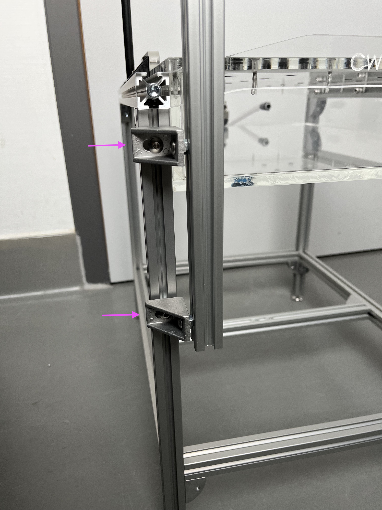
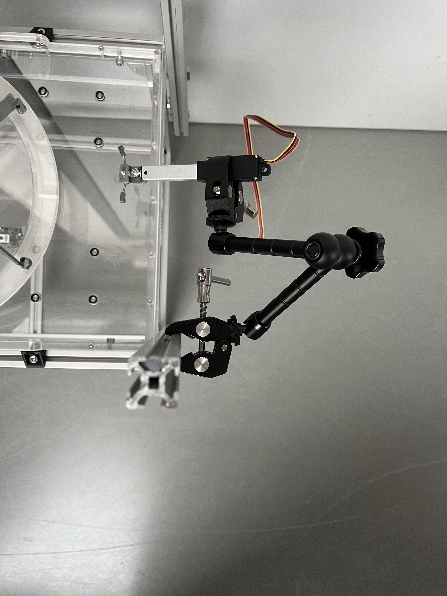
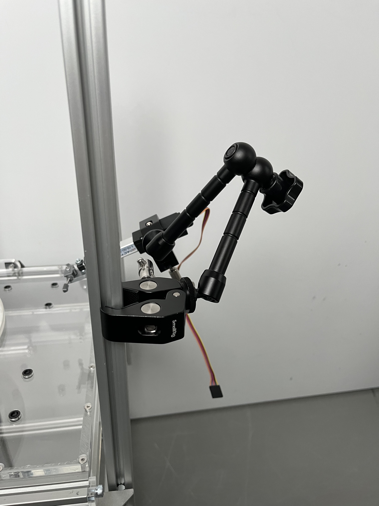

# Construction of the rewarding system

We will fix here a linear actuator that will bring the reward to the animal. The reward itself is delivered with two solenoid valves.

A buzzer is added to the system but do not need to be fixed to the table.

{{BOM}}

## Additional framework {pagestep}

The following elements will be placed on the air table struts opposite of the pressure relief valve.

- Place two outside pointing (air table center as perspective) [nut](connectors.yml#5mmNuts){Qty:4}s in each vertical [aluminium strut profile](framework.yml#20x20Rod) of the [center air table](fromstep){qty:1}. Place one around  the height of the lower framework and one close to the top of the [aluminium strut profile](framework.yml#20x20Rod). 

- Attach to all nuts an [angle](connectors.yml#5mmNuts_angle){Qty:4} by using [M5 screw (12mm)](screws.yml#m5x12mm_screw){Qty:4}. The angles must point towards the angles on the other strut profile.
     - Between the strut and the angle a [M5 hexagon nut](screws.yml#m5_hexagon_nuts){Qty:4}s is needed because of the shape of the angle. 
         - Alternatively you could use a three millimeter spacer for M5 screws or get extra angles with a flat outside.

- Attach to both sides vertical an [aluminium strut profile](framework.yml#20x20Rod) which raises 250 mm above the airtable by using [M5 screw (6mm)](screws.yml#m5x6mm_screw){Qty:4} and [nut](connectors.yml#5mmNuts){Qty:4}s at the attached strut profiles. 
     - Between the strut and the angle a [M5 hexagon nut](screws.yml#m5_hexagon_nuts){Qty:4}s is needed because of the shape of the angle. 
         
- The exact length is depending on your choices of the general height. 

- Now place one [nut](connectors.yml#5mmNuts){Qty:2} in each just attached, vertical [aluminium strut profile](framework.yml#20x20Rod). The [nuts](connectors.yml#5mmNuts) in each [aluminium strut profile](framework.yml#20x20Rod) needs to point to each other. 

    - Attach to these [nut](connectors.yml#5mmNuts)s an [angle](connectors.yml#5mmNuts_angle){Qty:2} by using [M5 screw (6mm)](screws.yml#m5x6mm_screw){Qty:2}. The unattached side needs to point towards the air table. 

- Take one  [aluminium strut profiles (length: 326mm)](fromstep){Qty:1} and place it horizontal at the vertical [aluminium strut profiles](framework.yml#20x20Rod) pointing to the air table.

 - Use two [nut](connectors.yml#5mmNuts){Qty:2}s and two [M5 screw (6mm)](screws.yml#m5x6mm_screw){Qty:2} to fixate the [aluminium strut profiles](framework.yml#20x20Rod).

- The lower edge should be at the height of the air table surface. This works as one platform border. 

#### Image for tasks of step 1

## Platform borders {pagestep}

- Place four [nut](connectors.yml#5mmNuts){Qty:8}s in each upper [aluminium strut profiles](framework.yml#20x20Rod) of the U-formation frame. 
    - Insert them from the pressure reliefe side.

- Use the deepest and third deepest [nut](connectors.yml#5mmNuts)s and place them with a distance of 150 mm from the center in both directions. Attach an [angle](connectors.yml#5mmNuts_angle){Qty:4} to each by using [M5 screw (6mm)](screws.yml#m5x6mm_screw){Qty:4}. Just leave the nut in between for later (head fixation).
     - Between the strut and the angle a [M5 hexagon nut](screws.yml#m5_hexagon_nuts){Qty:4}s is needed because of the shape of the angle. 

- The angles should point towards the air table.

- Fixate the [350mm x 30mm plexiglass plate](plexiglass.yml#350x30pg){Qty: 1} with two [M5 screw (12mm)](screws.yml#m5x12mm_screw){Qty:4} and two [M5 hexagon nut](screws.yml#m5_hexagon_nuts){Qty:4}s at the angles on both sides.
- Therefore mark and predrill the spots of the angle holes at the plexiglass for the screws with a [5mm drill](tools.yml#5mmdrill) in advantage.

- Place the at last inserted nuts at both ends (side with pressure relieve valve) of the [aluminium strut profiles](framework.yml#20x20Rod) of the U-formation frame.

- Attach two [angle](connectors.yml#5mmNuts_angle){Qty:2}s to the [nuts](connectors.yml#5mmNuts) by using [M5 screw (6mm)](screws.yml#m5x6mm_screw){Qty:2}. 

- The angles should point to the outside.

- Mark the angle holes at the [366mm x 30mm plexiglass plate](plexiglass.yml#366x30pg){Qty: 1} and predrill them with a [5mm drill](tools.yml#5mmdrill).

- Attach the [366mm x 30mm plexiglass plate](plexiglass.yml#366x30pg) by using two [M5 screw (12mm)](screws.yml#m5x12mm_screw){Qty:2} and two [M5 hexagon nut](screws.yml#m5_hexagon_nuts){Qty:2}s.

## Fixing the linear actuator {pagestep}

- Place two [SmallRig super clamp](framework.yml#smallrig_super_clamp){Qty:2} at both ends of the [SmallRig articulated_arm](framework.yml#smallrig_articulated_arm){Qty:1}. 

- Use one [SmallRig super clamp](framework.yml#smallrig_super_clamp) to place the moving arm at one of the vertical strut profiles above the table, which side is up to you.

- Place the [linear actuator](electronic.yml#LinActuator50mm){Qty:1} in the [SmallRig Super Clamp](framework.yml#smallrig_super_clamp) close to the center end of the not moving part. 

    - In the case you didn't attach the 3D prints at the front of the linear actuator, the front hole in the [linear actuator](electronic.yml#LinActuator50mm) needs to point upwards.

- Move the articulated arm and linear actuator to have the linear actuator orientated along the long side and centered. The moveable end needs to point towards the pressure relief valve. The super clamp should be around 10 cm above the table and 5 cm from the short airtable edge. The linear actuator should point around 30° downwards.

#### Pictures of the linear actuator placed with the SmallRig moveable arm

## Fixing the solenoid pinch valve {pagestep}

Place one [solenoid pinch valve](electronic.yml#pv){Qty:2} at the top of each vertical [aluminium strut profile](framework.yml#20x20Rod). 

- Therefore place a [nut (M4)](connectors.yml#4mmNuts){Qty:2} at the top of each [aluminium strut profile](framework.yml#20x20Rod) and fixate a  [pinch valve clamp](electronic.yml#pv_clamp){Qty:2} on each with a [M4 screw (6mm)](screws.yml#m4x6mm_screw){Qty:2}.

- Place the [solenoid pinch valve](electronic.yml#pv) inside the [pinch valve clamp](electronic.yml#pv_clamp).

##  Tube placement {pagestep}

Finally you need to path the tubing from you source of reward through the solenoid pinch valve to the needle at the linear actuator front.

- Use some [cable ties](connectors.yml#cable_tie){Qty:many} to guide the [tube](electronic.yml#pv_tube){Qty:1} to the needle.

     - Keep enough margin for maneuver for the tube as the linear actuator is moving.
     - Don't pull the [cable ties](connectors.yml#cable_tie) tight as liquid needs to flow through.

